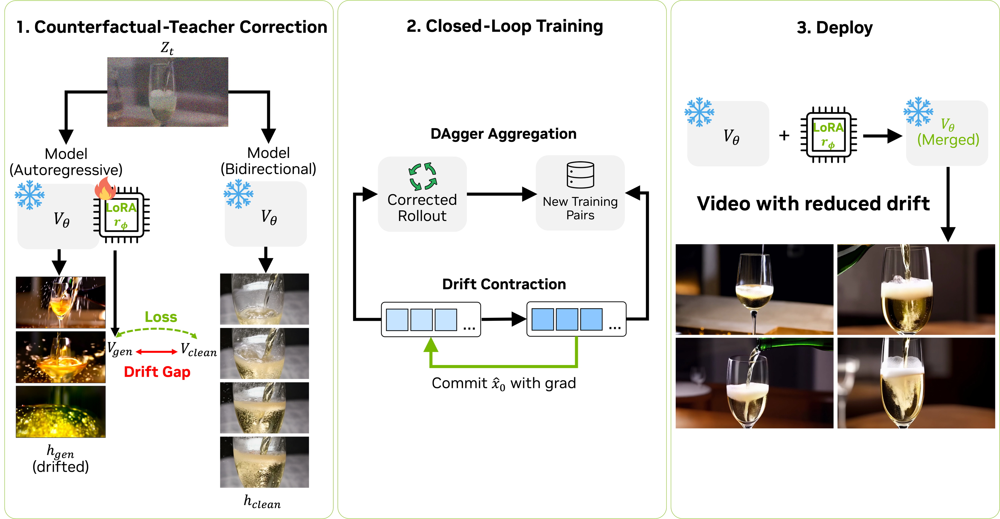
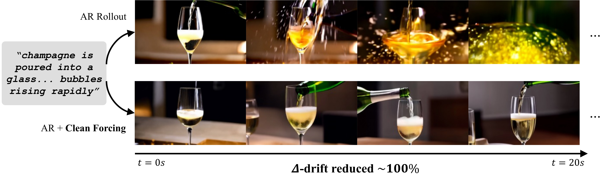
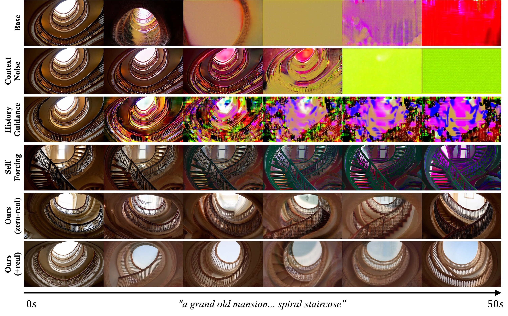
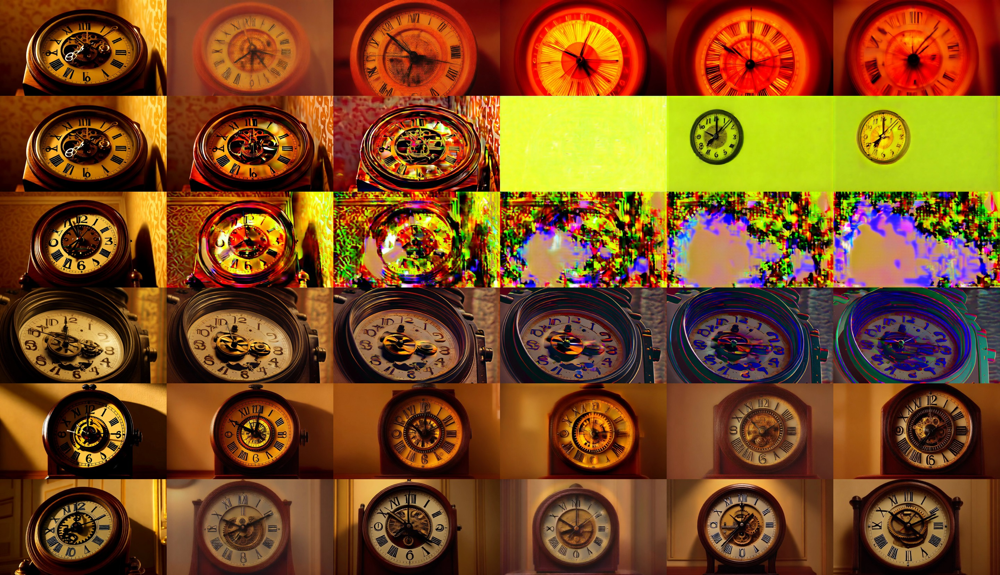
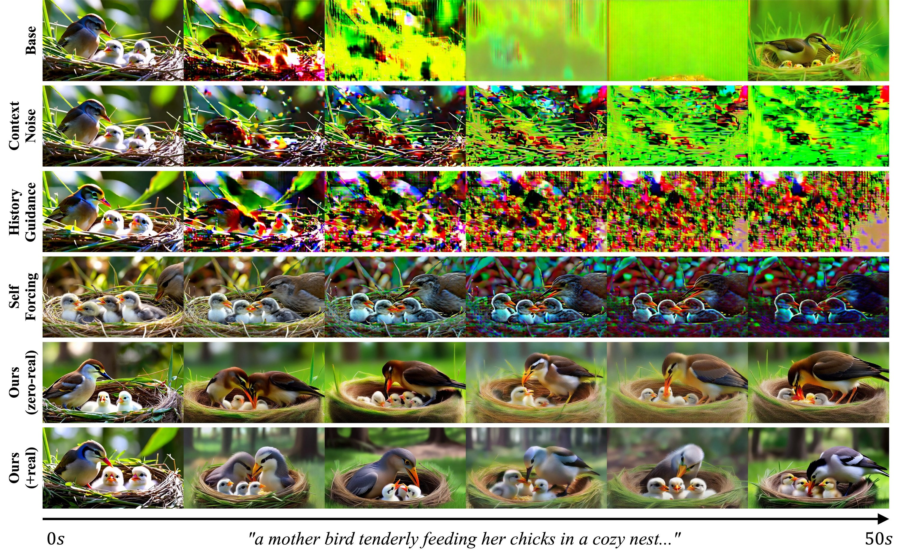
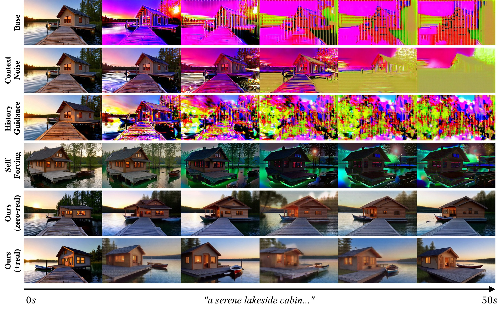
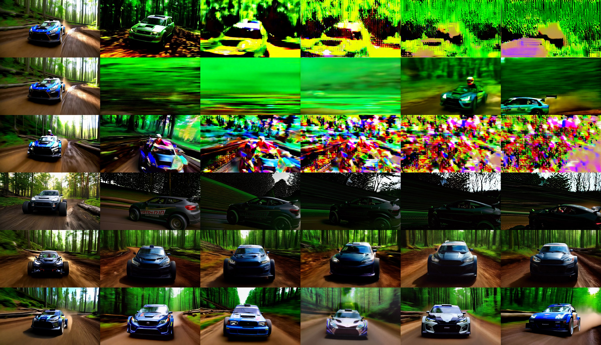
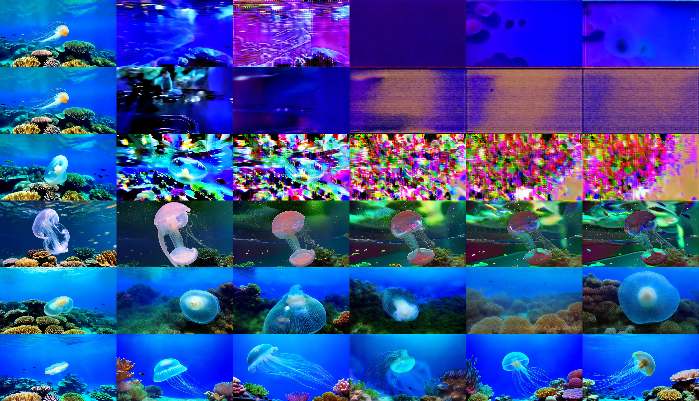
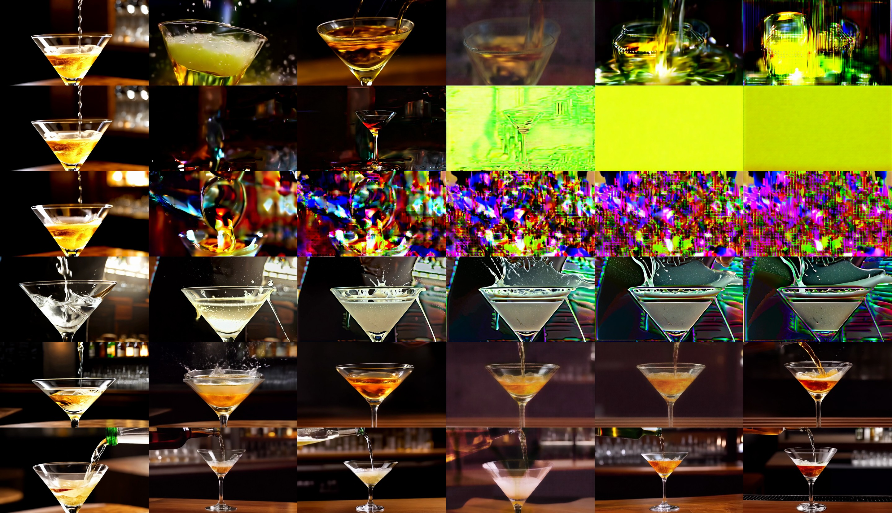
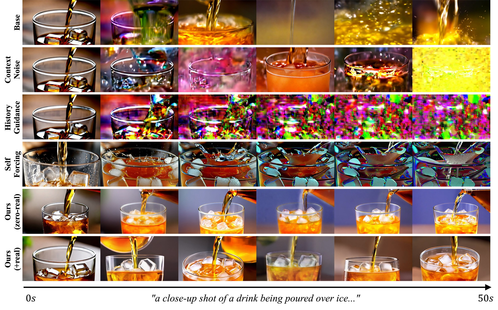

# Clean Forcing

[Project page](https://clean-forcing.github.io/) · [Paper (PDF)](https://clean-forcing.github.io/static/pdfs/clean_forcing.pdf) · [Checkpoints (HF)](https://huggingface.co/illustro1/clean-forcing) · [Videos & measurements (HF)](https://huggingface.co/datasets/illustro1/clean-forcing-results)

> *"…where, if the first object had not been, the second never had existed."*
> — David Hume, defining causation by counterfactuals (*An Enquiry Concerning Human Understanding*, 1748)

**Drift-resistant autoregressive video diffusion with a frozen base.** A 5.9M-parameter LoRA
corrector removes long-horizon drift from an AR video diffusion model with over 150× less data than
corrective retraining, trainable with **zero real videos**, merging into the weights at **zero
inference cost**.

## Why this method

- **Zero real videos, ~1 GPU-day per host** — trains from the model's own counterfactual predictions;
  no data pipeline, licensing, or curation. Over 150× less data (and far less compute) than corrective
  retraining (BAgger-class).
- **Non-invasive** — the base stays frozen; `corrector=None` is byte-identical to stock behavior.
  Merges into the weights at **zero inference cost**.
- **Measured before built** — the step-0 `α*(t)` gate predicts correction headroom on a new host
  before any training (validated across three hosts: it green-lit two and correctly predicted the
  one do-not-correct case).
- **Scales with the host** — the identical recipe transfers unchanged to Wan2.1-14B (10x params):
  32-prompt OOD 50 s: **Δ-drift −94% (+15.65 → +0.97), MUSIQ 46.4 → 69.0**, official VBench improves
  on every dimension at unchanged dynamic degree (~3 GPU-days end-to-end; paper appendix
  "Scale transfer").

## Idea

AR video diffusion drifts: conditioning on self-generated history pulls rollouts off-manifold
(saturation runaway, texture death). We measure that this drift is a **~95% systematic velocity
error**: at the *same* noisy state `z_t`, the gap between the model's prediction under drifted
history and under clean history is reproducible across noise seeds (Drift-SNR
`α*(t) = ‖bias‖²/(‖bias‖²+var) ∈ [0.89, 0.99]` at every noise level). A systematic error is a
learnable map.

The full method in one picture — counterfactual teacher (shared `z_t`, history swapped), closed-loop
training (DAgger + drift contraction), and zero-overhead merged deployment:



**Base.** Wan2.1-T2V-1.3B run block-causally: 3-latent-frame chunks, 20-step UniPC, 832×480 @ 16 fps,
rolling 21-frame KV cache, CFG 6 / shift 8. For un-seeded T2V the raw bidirectional weights get a light
**causal adaptation**: Diffusion-Forcing objective (per-chunk independent noise, shift-8 timestep
sampling), LoRA r64 merged into the base, 6K steps × batch 1 on the 300 synthetic clips
(4K-step checkpoint deployed) — `wan_train_adapt.py`.

**Corrector r_φ (v1 — counterfactual teacher).** LoRA r16 on self-attn q/k/v/o = 5.9M params (~0.4%),
zero-init `B` (starts as an exact identity), runtime-scalable. With `z_t = (1−σ_t)·x0 + σ_t·ε`,
current chunk `x0 = gen[k:k+3]`, drifted history `h_gen = gen[k−9:k]`, clean counterpart history
`h_clean` (same positions, reference clip):

```
L = E_{k,t,ε}  ‖v_{θ+LoRA}(z_t, h_gen, t) − v_θ(z_t, h_clean, t)‖² / ‖v_θ(z_t, h_clean, t) − v_θ(z_t, h_gen, t)‖²
```

teacher = base weights (LoRA scale 0), student = scale 1; the denominator is drift-gap
normalization (per-sample self-calibration; val `R² = 1 − L`). **Anchoring**: both passes share the
*same* `z_t` — only the history differs — which isolates the drift signal deterministically
(GT-anchored `z_t` provably *injects* drift; native anchoring from the model's own rollout is required).

**v2 (closed loop).** Initialized from v1, two additions:
- **DAgger** — regenerate the pair set with the current corrector *active* (round-1 states = what the
  deployed corrector actually visits) and train on the aggregated pool;
- **drift contraction** — commit the corrected one-step estimate `x̂0 = z_t − σ_t·v_corr` *with
  gradient* into the next chunk's history and penalize that chunk's velocity gap against the clean
  teacher (weight 0.5) — optimizing the error-accumulation mechanism directly.

**Zero real videos.** Clean references `h_clean` are 5 s clips generated by the *same checkpoint* in
bidirectional single-shot mode (30 solver steps); they double as the causal-adaptation data.

**Deploy.** `v_rect = v_θ + α·(v_{θ+LoRA} − v_θ)` — at α = 1 this is exactly the merged-LoRA forward
pass (zero inference overhead, ΔNFE = 0). The measured `α*(t)` profile is the deploy dial: on this
host it is flat (≈0.95 ∀t), so the gate is the *diagnostic justifying* full correction; on hosts with
non-flat `α*(t)` (e.g. distilled world models) it becomes a live per-step gain schedule.

Geometrically (panel 1 above): both teacher and student are evaluated at the **same anchor state**
`z_t`; the two velocity fields (clean-history vs drifted-history) disagree by the drift residual,
and the corrector learns exactly that gap.

**Headline (128 MovieGen prompts, un-seeded 50 s T2V):** Δ-drift +11.27 (host) → **+1.65 zero-real
/ −0.16 with 40 real clips**; leads all compared systems on aesthetic quality **and prompt adherence
(VBench overall consistency 70.28 — top of all 9 systems; drift destroys text alignment, correction
restores it)**; horizon-flat under 10/30/50 s truncation; below BAgger R3's +3.57 with over 150× less data.
Rank sweep: open-loop fit is flat in rank (r8–r64) while rollout quality peaks at r16 — the low-rank
constraint is itself the stability regularizer; correction leaves inter-seed diversity unchanged. Known, measured trade: drift removal and
scene progression are the same optimization for past-anchored correctors (paper appendix).

## Qualitative comparisons

The same frozen base before and after correction: the adapted AR rollout (top) saturates and
loses the scene, while the same model with the merged corrector (bottom) keeps it:



Frame strips over the full 50 s horizon, matched prompts and seeds (rows top→bottom: adapted
base, context noise, history guidance, Self Forcing, ours zero-real, ours +real):









## Layout

- `self_forcing/` — modified [Self-Forcing](https://github.com/guandeh17/Self-Forcing) tree:
  Wan2.1-1.3B block-causal pipeline (`pipeline/causal_diffusion_inference.py` — corrector hooks,
  α*(t) gate, overlap/TTC/HG experiment modes), LoRA (`wan/modules/lora.py`), and all training
  entry points (`wan_*.py`, root).
- `scripts/` — evaluation & analysis: subset evaluator, protocol metrics, full-rate re-score,
  paired progression, official VBench scoring (`score_official_6dim.py`, `score_official_semantic.py`), figures.
- **Paper & project page:** https://clean-forcing.github.io/
- `paper_tables.md` — full result tables with provenance (all configs, all protocols, canonical
  metric values behind every paper number).

## Reproduce

Environment: torch ≥ 2.4 + CUDA, plus `pyiqa timm imageio omegaconf einops`. Download
`Wan2.1-T2V-1.3B` into `self_forcing/wan_models/`. All commands run from `self_forcing/`;
1 GPU (≥ 48 GB), bf16. Total ≈ 3 GPU-days end-to-end.

```bash
# 1. Synthetic reference clips (zero-real teacher data; ~300 clips, bidirectional single-shot)
python wan_gen_synthetic.py                          # -> wan_cache/synth_clips.pt

# 2. Light causal adaptation of the base (DF objective, LoRA r64 -> merged checkpoints)
STEPS=6000 python wan_train_adapt.py                 # -> wan_cache/adapted_base_{2000,4000,6000}.pt
                                                     # deploy adapted_base_4000.pt

# 3. Drift pairs (clean refs + drifted rollouts, teacher-forced windows)
ADAPTED_BASE=wan_cache/adapted_base_4000.pt python wan_build_pairs_synth.py   # -> pairs_synth_adapt.pt

# 4. Corrector v1 (counterfactual clean-history loss)
PAIRS=pairs_synth_adapt.pt CKPT=lora_r_phi_synth_adapt.pt \
  ADAPTED_BASE=wan_cache/adapted_base_4000.pt python wan_train_synth.py

# 5. DAgger round-1 pool (regenerate pairs with v1 active), then v2 (+contraction)
CORRECTOR=wan_cache/lora_r_phi_synth_adapt.pt OUT=pairs_synth_dagger_adapt.pt \
  ADAPTED_BASE=wan_cache/adapted_base_4000.pt python wan_build_pairs_synth.py
K=21 POOLS=pairs_synth_adapt.pt,pairs_synth_dagger_adapt.pt INIT=lora_r_phi_synth_adapt.pt \
  CKPT=lora_r_phi_v2s_adapt.pt LOSS_MODE=both ADAPTED_BASE=wan_cache/adapted_base_4000.pt \
  python wan_train_v2.py                             # -> the shipped corrector (av2s)

# 6. Finals: 128-prompt 50s rollouts + scoring
LORA=wan_cache/lora_r_phi_v2s_adapt.pt TAG=av2s N=128 ADAPTED_BASE=wan_cache/adapted_base_4000.pt \
  python ../scripts/eval_corrector_subset.py         # MUSIQ + Δ-drift + videos (Table 1 cols 7-8)
python ../scripts/score_official_6dim.py             # official VBench 6 dims (Table 1 cols 1-6)
TAGS=av2s,abase,sfd,skyr N=128 python ../scripts/posthoc_metrics.py   # protocol metrics (appendix)
FULLRATE=1 TAGS=av2s,av2,sfd,skyr python ../scripts/score_fullrate.py # full-frame-rate robustness
python ../scripts/make_paper_figures.py              # money curve, premise, scaling figures
```

Table map: step 6 produces Table 1 (main), the protocol-metrics appendix table, and the
robustness sentence; `wan_train_lora.py`/ablation trainers reproduce the ablation table rows;
the in-domain 2×2 uses `wan_build_pairs.py` + `wan_train_lora_k48.py` on the 40-clip real domain.

## Experiment design (summary)

- **Protocols**: (i) in-domain extension 2×2 (5 held-out clips × 3 seeds, paired), (ii) 128
  LLM-refined MovieGenVideoBench prompts, un-seeded 50 s T2V, one seed/prompt, (iii) short-horizon
  do-no-harm (200 VBench prompts @ 5 s).
- **Metrics**: official VBench custom-input (6 calibrated dims); Δ-drift (BAgger protocol, MUSIQ);
  corroborated with ΔQualityDrift, quality-vs-time curves, color shift, anchored survival,
  t-LPIPS; dynamic-degree and flicker guards against degenerate static "wins"; protocol additions:
  opening-stickiness (anchoring), lagged (2 s) identity, cut rate — one code path
  (`scripts/posthoc_metrics.py`).
- **Baselines**: Tier A (same base, exact published equations: context noising, history guidance,
  DMD-LoRA, naive LoRA, pathwise TTC — each reproduces its source's own qualitative finding);
  Tier B (original code: Self Forcing, same prompts); Tier C (published†: BAgger, SkyReels-V2-DF,
  MAGI-1, ...). Positioning: the only *learned* intervention on an untouched base.
- **Key configs**: `abase` (adapted host) · `av2s` (host + v2 corrector, zero-real — shipped) ·
  `av2` (+40 real clips) · `sfd` (Self Forcing) · `skyr` (SkyReels-V2-DF).

## Clean Forcing as a training objective (design sketch — for world-model training)

**Setting.** Instead of a post-hoc LoRA on a frozen base, add the counterfactual clean-history loss as a
regularizer *inside* base causal/AR training (Cosmos-style WFM runs: causal video diffusion at scale, often
with action/camera conditioning and actor/learner rollout infrastructure — exactly the machinery this needs).

**Objective.** Let θ be the student, θ̄ an EMA (or periodically frozen) teacher — required: a live self-teacher
drifts with the student and can collapse. Per step, sample a training clip x with true history h_clean at
chunk position k; produce a drifted history h_gen by rolling the *current* model out for m chunks from a
prefix of x (inference-only, stop-grad); anchor natively: z_t = (1−σ_t)·x0_roll + σ_t·ε from the rollout's own
chunk. Train:

    L = L_DF(θ; x)  +  λ_CF · L_CF,
    L_CF = E_{k,t,ε} ‖ v_θ(z_t, h_gen) − sg[ v_θ̄(z_t, h_clean) ] ‖²
           ───────────────────────────────────────────────────────
           ‖ sg[ v_θ̄(z_t, h_clean) − v_θ̄(z_t, h_gen) ] ‖² + δ

i.e., the same gap-normalized matched-state velocity loss as r_φ, with the teacher pass at EMA weights and the
true clip as h_clean (no synthetic refs needed — training data exists here). Optional v2-style contraction:
commit x̂0 = z_t − σ_t·v_θ into the next chunk's history with grad and penalize that chunk's gap (weight ~0.5).

**Cost control.** Rollouts amortize through a replay buffer: refresh each clip's h_gen every R optimizer steps
on async inference workers (actor/learner split); overhead ≈ m·T_solver/R extra forwards per step — at
m=4 chunks, T=20, R=100 that is ~0.8 forwards/step. Enable after a warmup (drift only exists once generation
is plausible); ramp λ_CF 0→~0.3.

**Predicted effects (from our measurements).** (i) Kills exposure-bias drift at the source — the ~95%
systematic velocity error never accumulates. (ii) Trains chunk-edge conditionals against a clean teacher →
prevents the block-edge seam pulse that fixed-cadence adaptation bakes in (our jitter/chunk-7 arms showed the
defect is conditioning-budget-bound, which full-scale training closes). (iii) The drift–progression trade
transfers: the pull is toward h_clean's continuation, so keep λ_CF moderate — and on motion-conditioned models
(Cosmos action/camera variants) condition the teacher on the *commanded future*, which rotates the anchoring
force into trajectory-following (the dichotomy's escape clause; impossible on T2V, native here).

**vs. alternatives at training time.** BAgger: aggregate rollouts + regenerate full targets (expensive
labels). Self-Forcing: distribution matching on rollouts (needs score/discriminator machinery). This: a
deterministic, gap-normalized velocity target at matched states — one teacher forward per sample, no
adversarial component, and self-calibrating (the denominator downweights states with no drift signal).
Trade-off vs. our paper's setting: loses frozen-base modularity and the 1000× rollout amortization; the win is
drift never being learned in the first place. Different paper.

## Additional qualitative results

More frame strips over the full 50 s horizon, matched prompts and seeds (rows as above:
adapted base, context noise, history guidance, Self Forcing, ours zero-real, ours +real):









## License

Code is released under the Apache License 2.0 (`LICENSE`). `self_forcing/` is a modified copy of
[Self-Forcing](https://github.com/guandeh17/Self-Forcing) and keeps its Apache-2.0 license; the Wan2.1
base models and the Causal-Forcing checkpoint are distributed by their authors under Apache-2.0.

## Citation

```bibtex
@article{wang2026cleanforcing,
  title={Clean Forcing: Drift-Resistant Autoregressive Video Diffusion with a Frozen Base},
  author={Wang, Wenqing and Shin, Joonghyuk and Tremblay, Jonathan and Song, Chan Hee and Fu, Yun},
  journal={arXiv preprint},
  year={2026}
}
```
